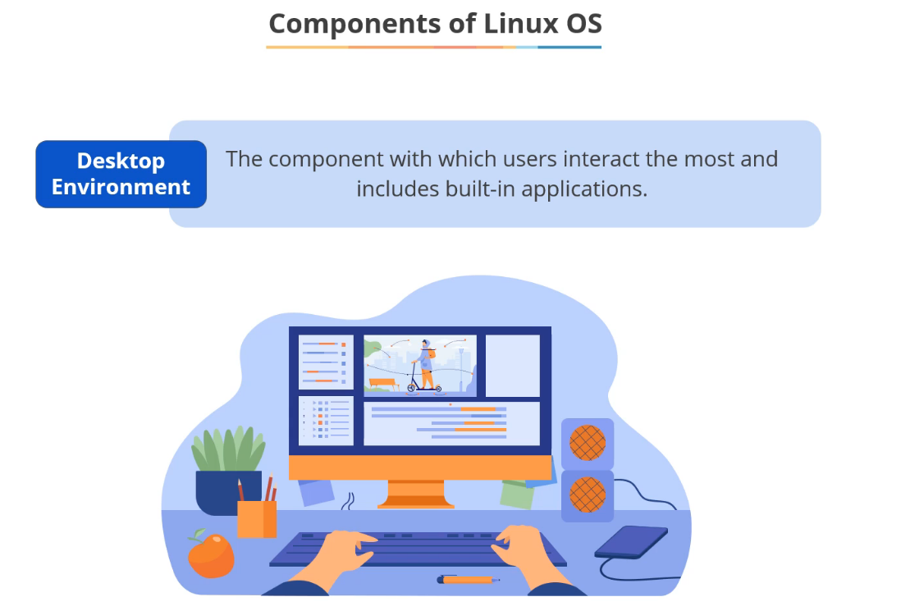

# JD DevOps Leanrnings

1. simplilearn : https://lms.simplilearn.com/courses/4880/Getting-Started-with-DevOps/syllabus

## Lesson 1.1 Course Introduction:

---
## Lesson 1.2 What you will learn:

### Required tools for DevOps

### 1. Linux Basics

### 2. Git/Github for VCS code maintance

### 3. Jenkins for CICD

### 4. selenium for automation testing

### 5. Ansible for Configuration Managment

### 6. Docker for Containerrization

### 7. Nagios for continuous monitoring

### 8. Kubernetes for container orchestration

---
## Lesson 2 Linux Refresher

## Lesson 2.1 Learning Objectives:

## Lesson 2.2 Linux Introduction:

## Lesson 2.3 Basic Linux Commands:

## Lesson 2.4 Quick Recap:

## Lesson 2.5 Knowledge Check:

---

