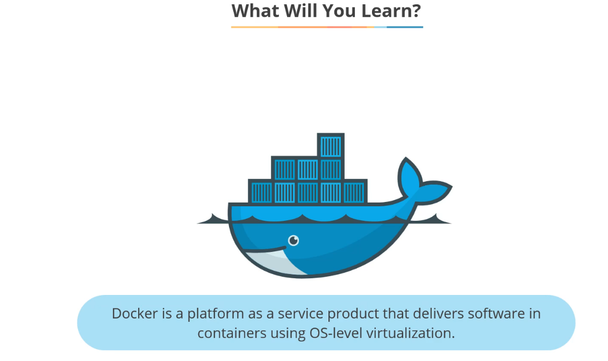
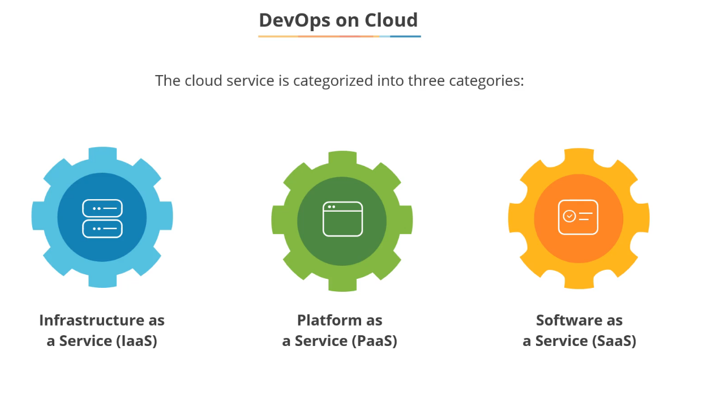
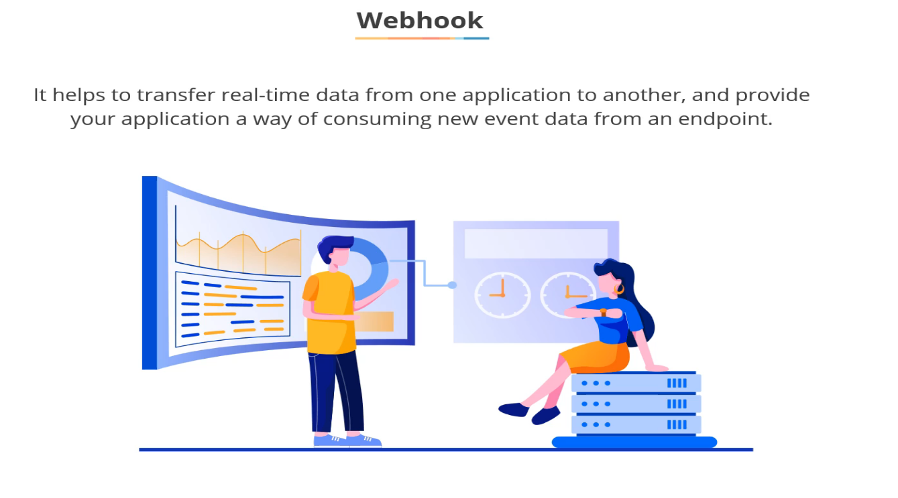

# JD DevOps Leanrnings

1. simplilearn : https://lms.simplilearn.com/courses/4880/Getting-Started-with-DevOps/syllabus

## Lesson 1.1 Course Introduction:

---
## Lesson 1.2 What you will learn:

### Required tools for DevOps

### 1. Linux Basics

### 2. Git/Github for VCS code maintance

### 3. Jenkins for CICD

### 4. selenium for automation testing

### 5. Ansible for Configuration Managment

### 6. Docker for Containerrization

### 7. Nagios for continuous monitoring

### 8. Kubernetes for container orchestration

---
## Lesson 2 Linux Refresher

## Lesson 2.1 Learning Objectives:

## Lesson 2.2 Linux Introduction:

## Lesson 2.3 Basic Linux Commands:

## Lesson 2.4 Quick Recap:

## Lesson 2.5 Knowledge Check:

---
## Lesson 3 Introduction to DevOps

## Lesson 3.1 Leanrnings Objectives

## Lesson 3.2 DevOps Overview

## Lesson 3.3 Tradional software Develipment approach: waterfall model

## Lesson 3.4 Tradional software Develipment approach: Agile model

## Lesson 3.5 Relationship between Agile and DevOps

## Lesson 3.6 Principles of DevOps

## Lesson 3.7 DevOps Lifecycle

## Lesson 3.8 Categories of DevOps Tools

## Lesson 3.9 Benefits of DevOps

## Lesson 3.10 DevSecOps

## Lesson 3.11 DevOps on Cloud

## Lesson 3.12 Quick Recap

## Lesson 3.13 Knowledge Check

---
## Lesson 4 : Version Control System

## 4.1 Learning Objectives

## 4.2 Overview of Version Control System

## 4.3 Overview of Git

## 4.4 Git Repository

## 4.5 Life cycle of Git and Git Workflow

## 4.6 Overview of GitHub

## 4.7 Git vs. GitHub

## 4.8 Git Commands

## 4.9 Demo - Deploy Files to GitHub via Git

## 4.10 Quick Recap

## 4.11 Knowledge Check

---

## Lesson 5 : Spotlight

## 5.1 Kickstarting DevOps with VCS

---
## Lesson 6 : CI/CD with Jenkins

## 6.1 Learning Objectives

## 6.2 Overview of CI/CD

## 6.3 Popular CI/CD Tools

## 6.4 Introduction to Jenkins

## 6.5 Setting Up Jenkins

## 6.6 Integrate Jenkins with Tools Like Git and Maven

## 6.7 Job Types in Jenkins

## 6.8 Scheduling Jenkins Jobs

## 6.9 Build Tools and Their Usage

## 6.10 Demo - Continuous Integration with Maven

## 6.11 Quick Recap

## 6.12 Knowledge Check